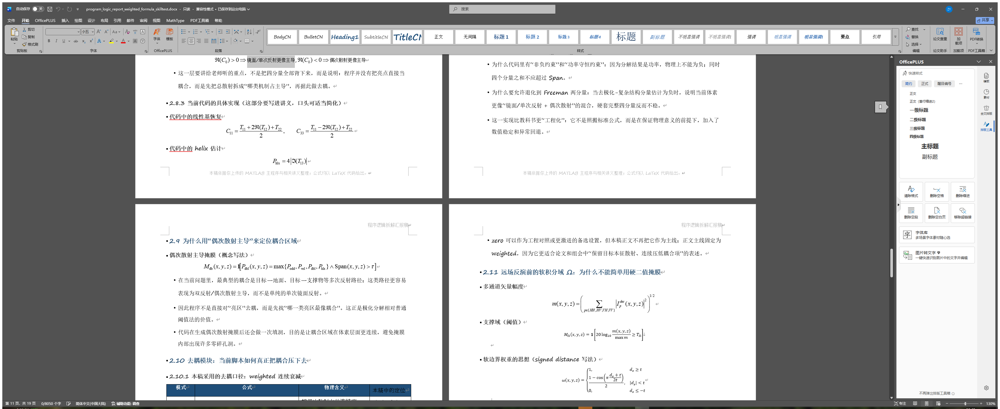

# Word LaTeX MathType Skill



> 在 Windows 上将 Word `.docx` 中的 LaTeX 公式文本批量转换为 MathType 或 Word 公式对象，内置显示公式 `$` 残留清理与中文 `\text{}` 混排修复。

## 快速开始

### 1. 准备环境

```powershell
cd "I:\CodexWorkSpace\Word&latex&pdf\word-latex-mathtype-skill"
powershell -ExecutionPolicy Bypass -File .\scripts\setup_environment.ps1
```

### 2. 执行转换

```powershell
powershell -ExecutionPolicy Bypass -File .\scripts\convert_docx_latex_to_equations.ps1 `
  -SourcePath "I:\CodexWorkSpace\Word&latex&pdf\program_logic_report_weighted.docx"
```

### 3. 查看输出

- 输出文档默认生成为 `原文件名_formula.docx`
- 日志默认生成为 `原文件名_formula_log.json`
- MathType 失败时会自动回退到 Word 原生公式

## 一键命令

### 首次使用

```powershell
cd "I:\CodexWorkSpace\Word&latex&pdf\word-latex-mathtype-skill"; powershell -ExecutionPolicy Bypass -File .\scripts\setup_environment.ps1; powershell -ExecutionPolicy Bypass -File .\scripts\convert_docx_latex_to_equations.ps1 -SourcePath "I:\CodexWorkSpace\Word&latex&pdf\program_logic_report_weighted.docx"
```

### 指定输入输出

```powershell
powershell -ExecutionPolicy Bypass -File .\scripts\convert_docx_latex_to_equations.ps1 `
  -SourcePath "I:\docs\input.docx" `
  -TargetPath "I:\docs\input_formula.docx" `
  -LogPath "I:\docs\input_formula_log.json"
```

## 示例截图

下面这张图展示的是转换完成后的 Word 文档窗口，公式已经不是普通 LaTeX 文本，而是可编辑的公式对象；其中包含分式、求和和中文混排等场景。

这是一个面向 Windows 环境的 Codex Skill，用来把 Word `.docx` 文档中的 LaTeX 公式文本转换成真正的公式对象。它优先使用 MathType 进行转换，在 MathType 不可用或单条公式转换失败时，会自动回退到 Word 原生公式。

这个 skill 不是简单地把 LaTeX 重新排版成普通文本，而是尽量把公式转换成可编辑、可继续在 Word 中维护的对象格式，适合论文整理、技术报告清洗、实验记录规范化和已有 Word 文档的公式修复。

## 主要能力

- 将独立公式段落转换为 MathType 或 Word 公式对象
- 将高置信的行内公式片段转换为公式对象
- 自动跳过已有的 OMath、InlineShape、OLE 等现成对象
- 自动生成转换日志，便于排查哪些公式成功、跳过、回退或失败
- 修复显示公式转换后两侧残留的字面量 `$`
- 对 `\text{中文}` 场景做特殊处理，避免中文在 MathType 中乱码

## 适用场景

- 你有一个现成的 `.docx` 文档，其中部分公式是 LaTeX 纯文本，希望批量转成公式对象
- 你希望优先使用 MathType 格式，只有在失败时才回退到 Word 原生公式
- 文档中同时包含中文说明和数学公式，尤其是 `\text{中文}` 这样的表达
- 你希望保留原有的 Word 公式、OLE 对象和内嵌对象，不想误伤已经处理好的内容
- 你需要一个可复用的脚本化流程，而不是手工逐条复制粘贴公式

## 核心设计

这个 skill 的转换策略是“MathType 优先，Word 回退，日志留痕”。

处理流程大致如下：

1. 复制源文档，只在副本上处理
2. 用 Word COM 打开目标文档
3. 扫描每个段落，识别独立公式和高置信行内公式
4. 对独立公式优先走 MathType 显示公式路径
5. 对行内公式优先走 MathType 行内公式路径
6. 如果 MathType 失败，则尝试 Word 原生 OMath
7. 如果两者都失败，则保留原公式文本并记录到日志

## 中文公式特殊处理

这个 skill 专门处理了包含中文的公式，尤其是这种形式：

```latex
\Re(C_0)>0 \Rightarrow \text{镜面/单次反射更像主导}
```

这类内容如果整段交给 MathType，中文往往容易出现乱码或不稳定显示。因此当前策略是：

- 数学部分继续转换成公式对象
- `\text{中文}` 中的中文部分拆出来，作为普通 Word 文本写回
- 最终效果是“公式对象 + 普通中文文本”的混排

这样做的目标不是强行把整段都塞进 MathType，而是优先保证中文可读性和文档稳定性。

## 显示公式 `$` 残留修复

MathType 在某些显示公式转换路径下，会在新建对象两侧保留字面量 `$`。这个 skill 在成功生成新的显示公式对象后，会围绕该对象检查相邻字符，并删除紧邻对象的多余 `$`，从而避免文档里出现孤立的 `$` 或控制字符夹杂 `$` 的问题。

## 环境要求

- Windows
- Microsoft Word
- 建议安装 MathType
- PowerShell
- Git
- GitHub CLI
- Python 3.12
- Python 包 `PyYAML`

其中 Python、Git、GitHub CLI 和 `PyYAML` 可以通过本 skill 自带的环境脚本自动检查或安装。

## 目录结构

```text
word-latex-mathtype-skill/
├── SKILL.md
├── README.md
├── .gitignore
├── agents/
│   └── openai.yaml
└── scripts/
    ├── setup_environment.ps1
    ├── convert_docx_latex_to_equations.ps1
    └── publish_to_github.ps1
```

## 文件说明

### `SKILL.md`

这是给 Codex 使用的主说明文件，包含中英双语版本，主要描述 skill 什么时候触发、应该如何使用、有哪些脚本和限制。

### `README.md`

这是给人阅读的中文说明文件，重点放在原理、流程、环境、命令、排障和维护方式上，适合放在 GitHub 仓库首页展示。

### `scripts/setup_environment.ps1`

这个脚本负责准备和检查环境，主要工作包括：

- 检测 Python 3.12 是否存在，不存在则尝试通过 `winget` 安装
- 检测 Git 是否存在，不存在则尝试安装
- 检测 GitHub CLI 是否存在，不存在则尝试安装
- 检测 Python 的 `PyYAML` 模块，不存在则通过 `pip` 安装
- 检测 Word 是否安装
- 检测 MathType 是否安装

执行命令：

```powershell
powershell -ExecutionPolicy Bypass -File .\scripts\setup_environment.ps1
```

### `scripts/convert_docx_latex_to_equations.ps1`

这是核心转换脚本。它会读取源文档，复制出新的目标文档，然后在目标文档中进行公式识别和转换。

常见用法：

```powershell
powershell -ExecutionPolicy Bypass -File .\scripts\convert_docx_latex_to_equations.ps1 `
  -SourcePath "I:\example\input.docx" `
  -TargetPath "I:\example\input_formula.docx" `
  -LogPath "I:\example\input_formula_log.json"
```

如果你只传 `-SourcePath`，脚本会自动推导默认输出路径：

- 输出文档：`原文件名_formula.docx`
- 输出日志：`原文件名_formula_log.json`

示例：

```powershell
powershell -ExecutionPolicy Bypass -File .\scripts\convert_docx_latex_to_equations.ps1 `
  -SourcePath "I:\docs\report.docx"
```

可能得到：

- `I:\docs\report_formula.docx`
- `I:\docs\report_formula_log.json`

### `scripts/publish_to_github.ps1`

这个脚本用来把当前 skill 仓库发布到 GitHub。它会：

- 检查环境
- 初始化 Git 仓库
- 检查 GitHub CLI 登录状态
- 必要时调用浏览器登录
- 自动设置 Git 用户名和邮箱
- 创建 GitHub 仓库
- 提交并推送到远端

常见用法：

```powershell
powershell -ExecutionPolicy Bypass -File .\scripts\publish_to_github.ps1 `
  -RepoRoot "I:\CodexWorkSpace\Word&latex&pdf\word-latex-mathtype-skill" `
  -RepoName "word-latex-mathtype-skill"
```

## 转换结果日志说明

脚本会输出一个 `.json` 日志文件，便于排查转换情况。常见状态包括：

- `display-mathtype`
  表示独立公式成功转换为 MathType 对象
- `display-mathtype-cjk-split`
  表示包含中文的独立公式被拆成“公式对象 + 普通文本”混排
- `inline-mathtype`
  表示行内公式成功转换为 MathType 对象
- `word-fallback`
  表示 MathType 转换失败，回退为 Word 原生公式成功
- `skipped-existing-object`
  表示该段已经有现成对象，因此跳过
- `failed`
  表示 MathType 和 Word 公式都失败，保留原文本

## 推荐使用流程

### 第一步：准备环境

```powershell
cd "I:\CodexWorkSpace\Word&latex&pdf\word-latex-mathtype-skill"
powershell -ExecutionPolicy Bypass -File .\scripts\setup_environment.ps1
```

### 第二步：执行转换

```powershell
powershell -ExecutionPolicy Bypass -File .\scripts\convert_docx_latex_to_equations.ps1 `
  -SourcePath "I:\CodexWorkSpace\Word&latex&pdf\program_logic_report_weighted.docx"
```

### 第三步：检查输出

重点检查以下内容：

- 显示公式是否还残留 `$`
- 中文公式是否出现乱码
- 原有 OMath/OLE 是否被错误替换
- 行内公式是否误伤正文
- 日志中是否存在 `failed`

### 第四步：如有需要再发布 skill

```powershell
powershell -ExecutionPolicy Bypass -File .\scripts\publish_to_github.ps1
```

## 已验证的行为

这个 skill 已针对 `program_logic_report_weighted.docx` 做过实测，验证过以下能力：

- 能批量识别并转换显示公式
- 能转换部分高置信行内公式
- 能去除显示公式转换后的多余 `$`
- 能处理两处包含中文 `\text{}` 的公式
- 能输出 JSON 日志
- 能在 GitHub 上自动建仓并推送

## 常见问题

### 1. 运行时提示源文档或目标文档被锁定

说明 Word 正在占用对应文件。关闭该文档后重新运行即可。脚本默认会保护目标文档，避免在文件被占用时强行覆盖。

### 2. MathType 没有被检测到怎么办

脚本仍然可以工作，但会更多依赖 Word 原生公式回退。若你明确希望最终尽量变成 MathType 对象，请先安装 MathType。

### 3. 为什么不是所有行内公式都被转换

这是有意的保守策略。因为正文里常常混有函数名、变量名、英文标识符和代码风格文本，如果激进匹配，容易误伤正文。当前实现只转换高置信片段。

### 4. 为什么中文公式不是整个都变成一个 MathType 对象

这是为了避免中文乱码。对 `\text{中文}` 这类内容，当前实现优先保证阅读效果和稳定性，因此采用“数学对象 + 普通文本”的混排。

### 5. GitHub CLI 已登录，但发布脚本还是失败

优先检查：

- `gh auth status` 是否显示当前账户已登录
- Git 是否已安装
- 仓库名是否已被占用
- 当前目录是否就是 skill 仓库根目录

必要时可以先手动执行：

```powershell
gh auth status
git status
```

## 已知限制

- 当前版本只支持 Windows
- 强依赖 Word COM 自动化
- 对特别复杂或嵌套很深的 LaTeX 结构，仍可能需要人工复查
- 对行内公式采用保守识别，不追求“全命中”
- 中文混排策略优先可读性，不保证所有中文公式都保留为单一 MathType 对象

## 维护建议

- 如果后续发现某类公式识别不稳定，可以优先补充到 `convert_docx_latex_to_equations.ps1` 的匹配规则里
- 如果发现更多中文宏场景，可以在 CJK 分段逻辑里继续扩展
- 如果需要支持更多平台，建议把 Word COM 依赖抽象成单独层，但这会显著增加复杂度
- 如果要提升仓库展示效果，可以继续增加 GIF 演示、示例输入输出和截图

## 安全说明

- GitHub 发布流程使用浏览器登录或 GitHub CLI 登录，不应在脚本中保存密码
- 不建议把账号密码写进命令历史、文档或仓库
- 如果密码曾在聊天、终端或文档中暴露，建议尽快修改
